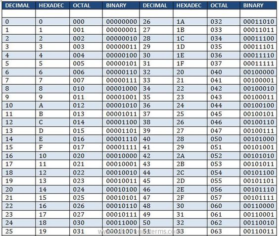

# Bit Manipulation

Values exist regardless of how we write them down.

|           |             |             |
|:---------:|:-----------:|:-----------:|
| 12 apples | 1100 apples |  C apples   |
|  decimal  |   binary    | hexadecimal |
 

**decimal**:  10 digits, base 10; 012345 etc. 
**binary**:  2 digits, base 2; 01 
    **binary digit**:  bit 
**hexadecimal**:  16 digits, base 16; 0-9, A-F, "hex" 
**octal**:  8 digits, base 8; 0-7, not frequently used 
 

**byte**:  8 bits, max value 255 decimal, FF hex, min value 0 
**nibble**:  4 bits, max value 215 decimal, F hex, min value 0 
**octet**:  synonym for byte 
 

**xor**:  exclusive or 
**nor**:  not or 
**nand**:  not and 

