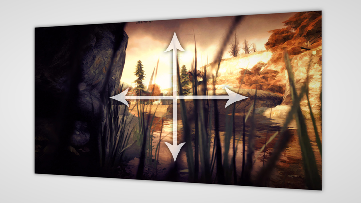

Preview.js
==========

Previewer for sharing images and videos on the web. Allows zooming, rotating and panning of media.



Example
-------

Simple full-screen image preview.

```html
<!doctype html>
<html>
	<head>
		<title>Preview</title>
		<meta charset="UTF-8">
		<script src="src/Preview.js"></script>
		<script>
			function init( ) {
				var media = new PREVIEW.Media( 'examples/estranged-screenshot.jpg' );
				var camera = new PREVIEW.SmoothedCamera( );
				
				// Drag to move, scroll wheel to zoom, middle click drag to rotate, esc to reset
				var input = new PREVIEW.BasicInputBehaviour( camera );
				
				var stage_element = document.getElementById( 'stage' );
				
				var stage = new PREVIEW.Stage( stage_element, media.create( ), camera );
				stage.create( );
				
				( function( ) {
					stage.update( );
					requestAnimFrame( arguments.callee );
				} )( );
			}
		</script>
		<style>
			body {
				margin:0px;
			}
		
			#stage {
				background: lightgray;
				height: 100%;
				width: 100%;
			}
		</style>
	</head>
	<body onload="init( )">
		<div id="stage"></div>
	</body>
</html>
```

For more example code, see the <a href="examples/">examples</a> folder.
