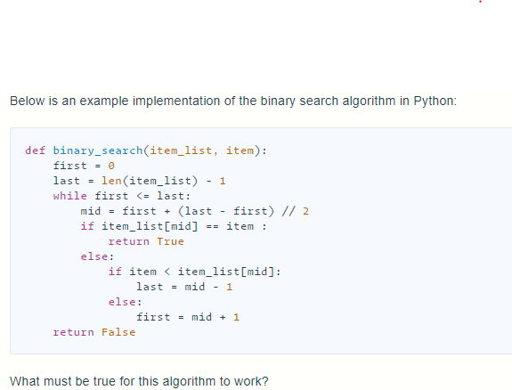

## Which logarithmic expression is identical to the following exponential expression?
>2^n = 64
> log_2(64)=n


# Binary Search




 
# item_list must be sorted from least to greatest.


---

For a given positive integer `n` determine if it can be represented as a sum of two [Fibonacci numbers](keyword://fibonacci-sequence) (possibly equal).

Example

-   For `n = 1`, the output should be\
    `fibonacciSimpleSum2(n) = true`.

    Explanation: `1 = 0 + 1 = F~0~ + F~1~`.

-   For `n = 11`, the output should be\
    `fibonacciSimpleSum2(n) = true`.

    Explanation: `11 = 3 + 8 = F~4~ + F~6~`.

-   For `n = 60`, the output should be\
    `fibonacciSimpleSum2(n) = true`.

    Explanation: `60 = 5 + 55 = F~5~ + F~10~`.

-   For `n = 66`, the output should be\
    `fibonacciSimpleSum2(n) = false`.

Input/Output

-   [execution time limit] 4 seconds (py3)

-   [input] integer n

    *Guaranteed constraints:*\
    `1 ≤ n ≤ 2 - 10^9^`.

-   [output] boolean

    `true` if `n` can be represented as `F~i~ + F~j~`, `false` otherwise.


```py

def fibonacciSimpleSum2(n):
    # if 0 is less than n and n is less than 5 then we know we can return
    # true because n will be 1-4 which can be created with 2 fib numbers
    if 0 < n < 5:
        return True

    # first get fibonacci sequence up to n
    seq = [0, 1]
    # starting from 2 and ending at n
    for i in range(2, n):
        # add seq at i - 2 (0 to start) and seq at i - 1 (1 to start)
        fib = seq[i - 2] + seq[i - 1]
        # if n is greater than fib
        if n >= fib:
            # we can append fib to the sequence
            seq.append(fib)
            # if fib is greater than or equal to n we can stop
        else:
            break
    print(seq)

    # The check I googled
    # for i, number in enumerate(seq[:-1]):
    #     paired = n - number
    #     if paired in seq[i + 1:]:
    #         return True

    # check if any 2 of the numbers in seq add up to n
    # My check
    for i in range(len(seq) - 1):  # O(n^2)
        j = 0
        while (seq[i] + seq[j]) != n:
            if j == len(seq) - 1:
                break
            else:
                j += 1
        if seq[i] + seq[j] == n:
            return True

    return False


print(fibonacciSimpleSum2(5))


```

---


Given an integer array `nums` sorted in ascending order, and an integer `target`.

Suppose that `nums` is rotated at some pivot unknown to you beforehand (i.e., [1,2,3,4,5,6,7] might become [4,5,6,7,1,2,3]).

You should search for `target` in `nums` and if found return its index, otherwise return -1.

Example 1:\
Input: nums = [6,7,1,2,3,4,5], target = 1\
Output: 2

Example 2:\
Input: nums = [6,7,1,2,3,4,5], target = 3\
Output: 4

Example 3:\
Input: nums = [1], target = 2\
Output: -1

Your solution should have better than O(n) time complexity over the number of items in the list. There is an O(log n) solution. There is also an O(1) solution.

Note:

1.  `1 <= nums.length < 100`
2.  `1 <= nums[i] <= 100`
3.  All values of `nums` are unique.
4.  Numbers from 1 up to the length of the list will be contained in the list.

-   [execution time limit] 4 seconds (py3)

-   [input] array.integer nums

-   [input] integer target

-   [output] integer


```py


def csSearchRotatedSortedArray(nums, target):
    min = 0
    max = len(nums) - 1

    while not max < min:
        guess = (max + min) // 2
        # print(f'min: {nums[min]} max: {nums[max]} guess:{nums[guess]} target:'
        #       f' {target}')
        # if the guess is the target we got it and return the guess
        if nums[guess] == target:
            # print('guessed the target')
            return guess
        # if min is less than or equal to the guess
        elif nums[min] <= nums[guess]:
            # print('min less than guess')
            # if min is less than or equal to the target and less than the guess
            if nums[min] <= target < nums[guess]:
                # print('min less than or equal to target and less than guess')
                # we can set max to the guess because nothing past the guess
                # can be the target
                max = guess
                # else we can set min to guess + 1 because nothing before it
                # can be the target
            else:
                # print('min is greater than target and greater than or equal '
                #       'to guess')
                min = guess + 1
        # else if min is greater than the guess
        else:
            print('min is greater than or equal to guess')
            # if max - 1 is greater than the target and greater than the guess
            if nums[max - 1] >= target > nums[guess]:
                # print('max - 1 greater than or equal to target and greater '
                #       'than guess')
                # we can set min to guess plus one because nothing before it
                # can be the target
                min = guess + 1
            else:
                # print('max -1 less than target and less than or equal to guess')
                # else we set max equal to guess because nothing after it can
                # be the target
                max = guess

    return -1


```
