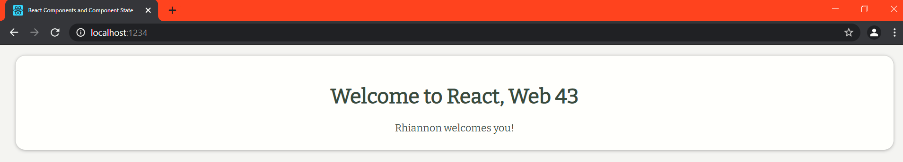
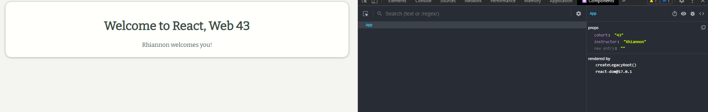

# React Components and Component State

## Running this project

This project is set up with [Parcel Bundler](https://parceljs.org/), an npm package
that compiles our frontend assets and comes with an integrated development server.

The dev server runs on port `1234` by default, but will use another if `1234` is
being used by another application.

- Clone the repo.
- Navigate into the project folder.
- Run `npm i` to download the project's dependencies listed in the `package.json`.
- Run `npm start` to compile the project and spin up a dev server on `http://localhost:1234`.


Icon of react via [wikimedia](https://commons.wikimedia.org/wiki/File:React-icon.svg)

For those of you who don't know what _create-react-app_( aka _CRA_) is:

> [Create React App](https://reactjs.org/docs/create-a-new-react-app.html#create-react-app) is a comfortable environment for **learning React**, and is the best way to start building **a new single-page application** in React.
> 
> It sets up your development environment so that you can use the latest JavaScript features, provides a nice developer experience, and optimizes your app for production. You'll need to have Node >= 8.10 and npm >= 5.6 on your machine.


When we use create-react-app tool it creates a hierarchy of files and folder. In this article we are going to have a look and explain this structure in as _minimalistic_ way as possible, more or less like _cheat-sheet_ so that you can come back to this article if you are confused about a file or folder created by create-react-app further down the road while learning react.

## the hierarchical structure that you are going to end up with, when using CRA, will look something like this:


Hierarchy of files and folders created by CRA


node\_modules(Folder)
---------------------

Contains all the dependencies that are needed for an initial working react app


.gitignore(file)
----------------

This file specifies intentionally untracked files that Git should ignore

package.json(file)
------------------

This file contains various **metadata** that is relevant to our project. It specifies the **dependencies** being used in the project which helps npm setup same environment on different machine for our project.

README.md(file)
---------------

This file can be used to define **_usage, build instructions, summary of project_**, etc. It uses markdown markup language to create content.

yarn.lock(file)
---------------

This file has same purpose as **package-lock.json**, it ensures that your package is **consistent** across various machines by storing the versions of which dependencies are installed with your package.


public folder

public(folder)
--------------

Root folder that gets served up as our react app.

favicon.ico(file)
-----------------

It's an icon file that is used in index.html as favicon.

index.html(file)
----------------

It is the template file which is served up when we run **start** **script** to launch our app. It is considered best practice not to create multiple html file in public folder instead use this file and inject react components in this file's root div container. Other css libraries, etc can be defined in this files.

logo192.png & logo512.png(files)
--------------------------------

These are react logo which is of dimension 192\*192 px and 512\*512 px and is used in the template file (index.html) by default. \[can be removed once you are using your own component\]

manifest.json(file)
-------------------

It's used to define our app, mostly contains metadata. Used by mobile phones to add web app to the home-screen of a device. Part of **PWA**.

robots.txt(file)
----------------

Defines rules for **spiders, crawlers and scrapers** for accessing your app.


src folder

src(folder)
-----------

In simplest form it's our react app folder i.e. containing **components, tests, css files** etc. It's the mind of our app.

App.css(file)
-------------

Contains styles of our react component(App.js)

App.js(file)
------------

This file has very basic react component defined which can be replaced by our own root component

App.test.js(file)
-----------------

A very basic test(for the default app) is defined in this file which can be replace by our own tests. _\[make use of_ **_Jest_**_\]_

index.css(file)
---------------

Contains styles for general setup of our app.

index.js(file)
--------------

This files renders our component and registers service workers(unregistered by default)

logo.svg(file)
--------------

Svg file of react logo, being used in component(App.js) by default.

serviceWorker.js(file)
----------------------

Service worker for pre-caching the scripts files of our react app thereby improving performance.

setupTests.js(file)
-------------------

As the name suggest this files setups tests and runs them. This file in directly invoked when we run tests from cli(_npm run test_)._\[make use of_ **_Jest_**_\]_


For further information you can use facebook's page for create-react-app [_here_](https://reactjs.org/docs/create-a-new-react-app.html#create-react-app).








> from react devtoos:


```

App


props

birthday
:
"October 31"
cohort
:
"43"
happy
:
true

instructor
:
"Rhiannon"
new entry
: 
""
rendered by
createLegacyRoot()
react-dom@17.0.1

```
